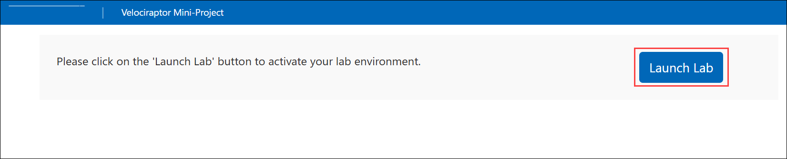
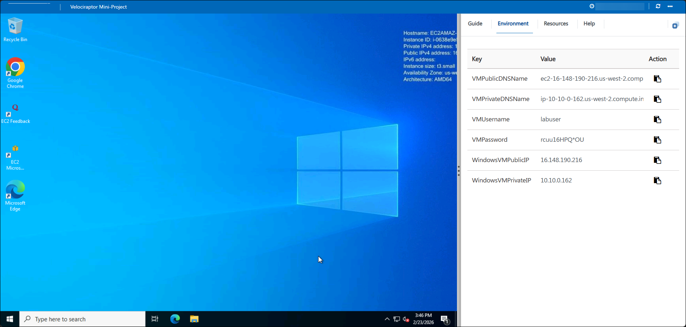
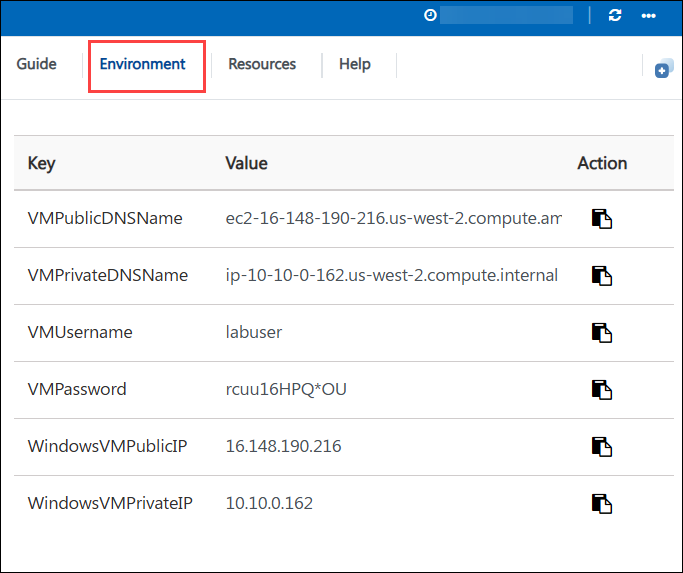
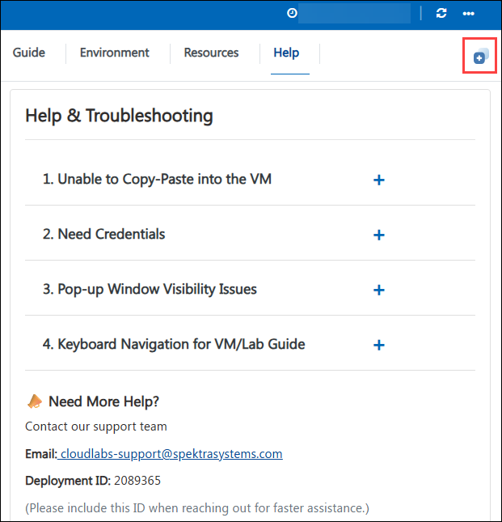
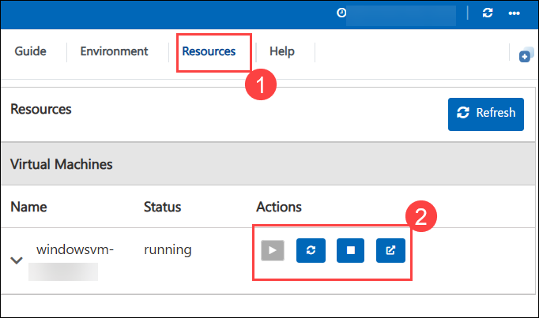
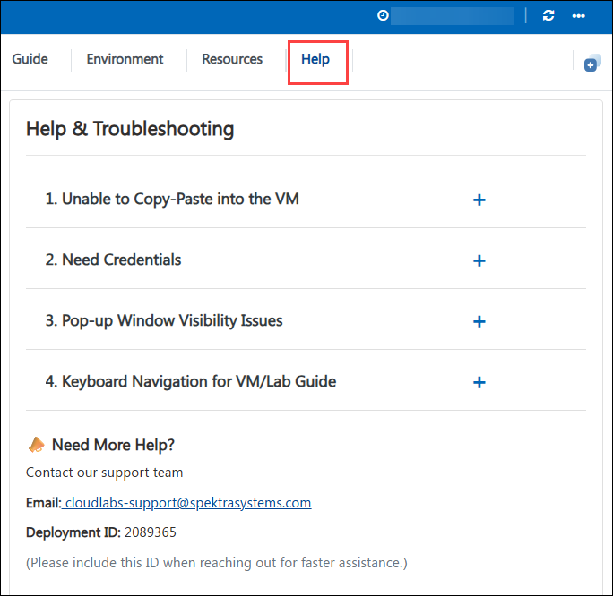

# Velociraptor Mini-Project

# Getting Started with the lab

## Instructions to Access and Use the Lab

Click on **Launch Lab** button to start the lab.

  

## Accessing Your Lab Environment
 
Once you're ready to dive in, your virtual machine and **Guide** will be right at your fingertips within your web browser.
 
  

## Virtual Machine & Lab Guide
 
Your virtual machine is your workhorse throughout the workshop. The lab guide is your roadmap to success.
 
## Exploring Your Lab Resources
 
To get a better understanding of your lab resources and credentials, navigate to the **Environment** tab.
 
  
 
## Utilizing the Split Window Feature
 
For convenience, you can open the guide in a separate window by selecting the **Split Window** button from the Top right corner.
 
  

## Managing Your Virtual Machine
 
Feel free to **Start, Restart, or Stop (2)** your virtual machine as needed from the **Resources (1)** tab. Your experience is in your hands!

   

## Access Help & Troubleshooting
 
For assistance, click the **Help** tab in the top navigation bar to access troubleshooting steps and support details.

   

## Support Contact
 
The CloudLabs support team is available 24/7, 365 days a year, via email and live chat to ensure seamless assistance at any time. We offer dedicated support channels tailored specifically for both learners and instructors, ensuring that all your needs are promptly and efficiently addressed.
 
Learner Support Contacts:
- Email Support: cloudlabs-support@spektrasystems.com
- Live Chat Support: https://cloudlabs.ai/labs-support

## Happy Learning!