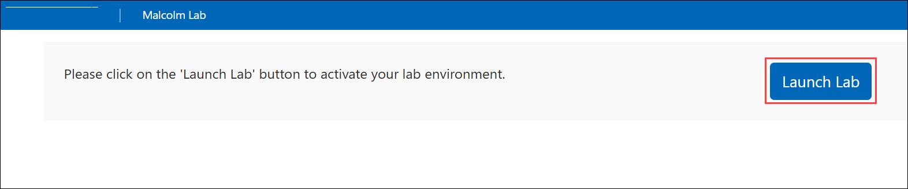
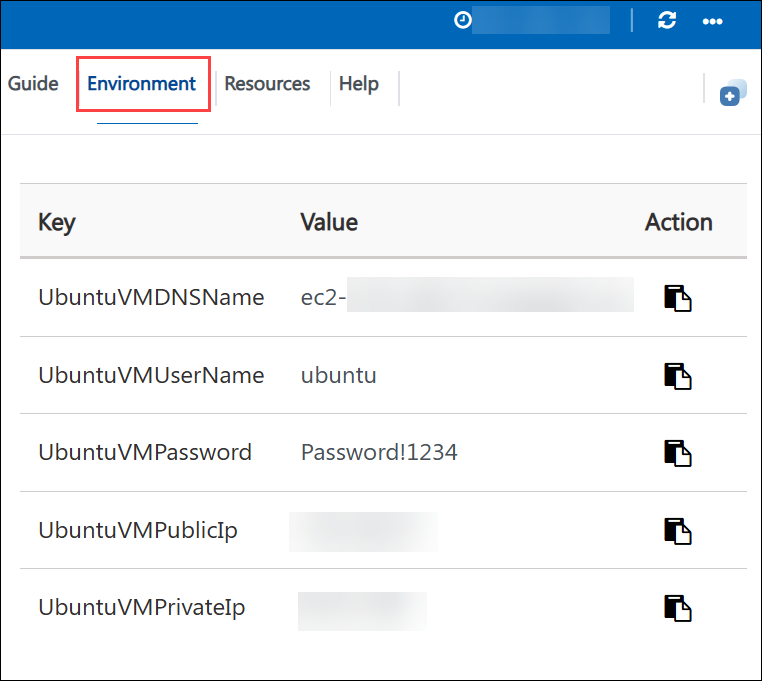
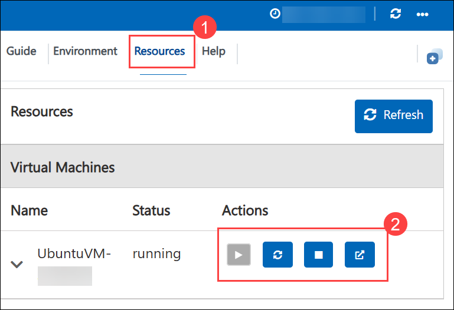
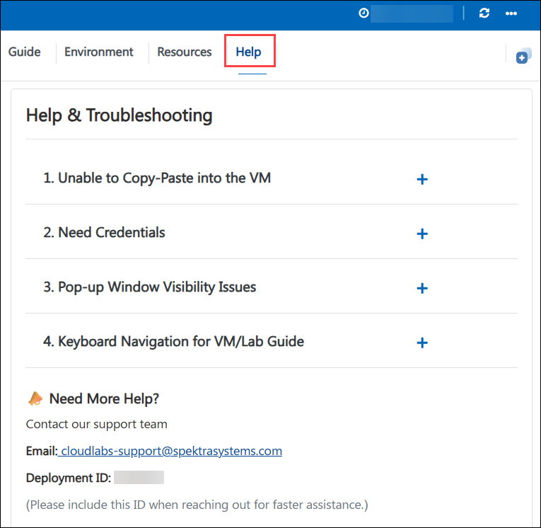
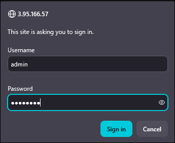
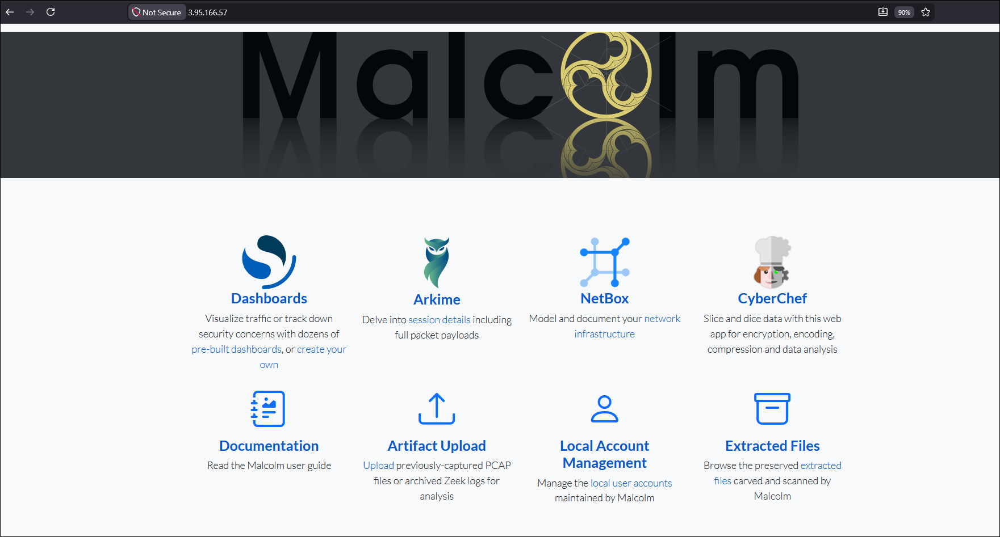

# Malcolm Lab

## Getting Started with the lab

## Instructions to Access and Use the Lab

Click on **Launch Lab** button to start the lab.

  

## Accessing Your Lab Environment
 
Once you're ready to dive in, your virtual machine and **Guide** will be right at your fingertips within your web browser.
 
  

## Virtual Machine & Lab Guide
 
Your virtual machine is your workhorse throughout the workshop.
 
## Exploring Your Lab Resources
 
To get a better understanding of your lab resources and credentials, navigate to the **Environment** tab.
 
  
 
## Utilizing the Split Window Feature
 
For convenience, you can open the guide in a separate window by selecting the **Split Window** button from the Top right corner.
 
  

## Managing Your Virtual Machine
 
Feel free to **Start, Restart, or Stop (2)** your virtual machine as needed from the **Resources (1)** tab. Your experience is in your hands!

  

## Access Help & Troubleshooting
 
For assistance, click the **Help** tab in the top navigation bar to access troubleshooting steps and support details.

  

## Accessing to Malcolm Server

1. Navigate to the **https://<inject key="UbuntuVMPublicIp" enableCopy="false"/>/** URL to access your Malcolm. 

   ```
   https://<inject key="UbuntuVMPublicIp" enableCopy="false"/>/
   ```
   
1. Provide the following credentials.

   - **Username:** `admin`

   - **Password:** `admin123`

     

1. You will be able to access you **Malcolm Server**.

   

## Happy Learning!